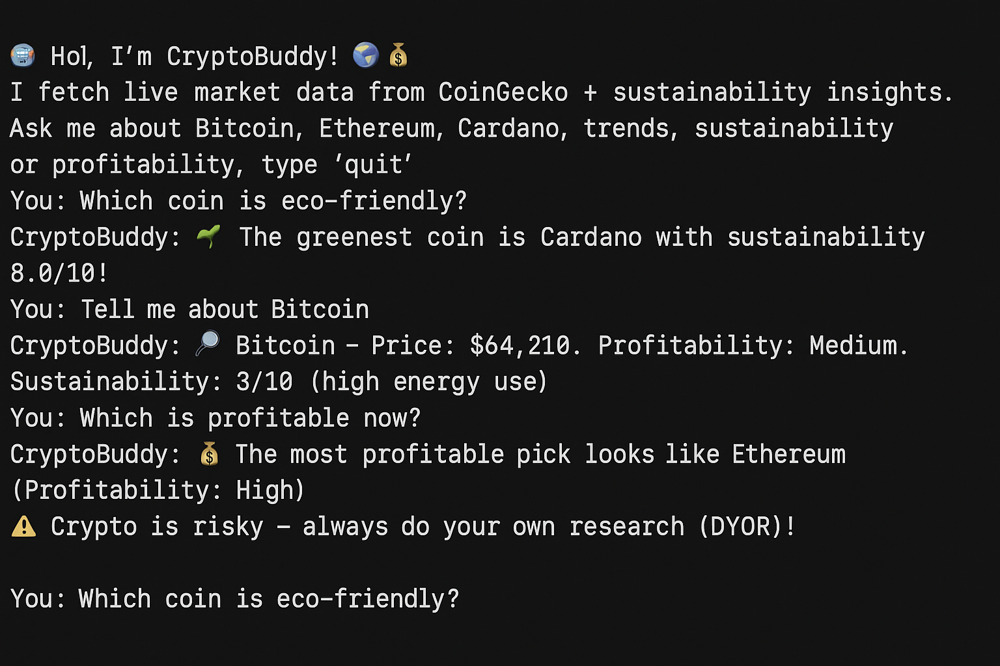

# # 🤖 CryptoBuddy  

[](https://www.python.org/)  
[](LICENSE)  
[](https://github.com/lucilla22/CryptoBuddy/commits/main)  
[](https://github.com/lucilla22/CryptoBuddy/stargazers)  

CryptoBuddy is a friendly chatbot that helps you explore cryptocurrencies by combining **real-time market data (CoinGecko API)** with **NLP-powered queries** for trends, profitability, and sustainability. 🌍💰  

> ⚠️ **Disclaimer:** Crypto is risky — always do your own research before investing!  

---

## ✨ Features  
- 📈 **Real-time data** from CoinGecko (prices, trends, market caps).  
- 🧠 **NLP support**: understands natural queries like *“eco-friendly coin”*, *“profitable crypto”*.  
- ♻️ **Sustainability insights**: compares coins by energy use and eco-scores.  
- ✅ **Beginner-friendly**: rule-based logic with clear, explainable decisions.  

---

## 🚀 Setup Guide  
## 📸 Screenshot

Here’s CryptoBuddy in action:




### 1. Clone the repository  
```bash
git clone https://github.com/lucilla22/CryptoBuddy.git
cd CryptoBuddy

